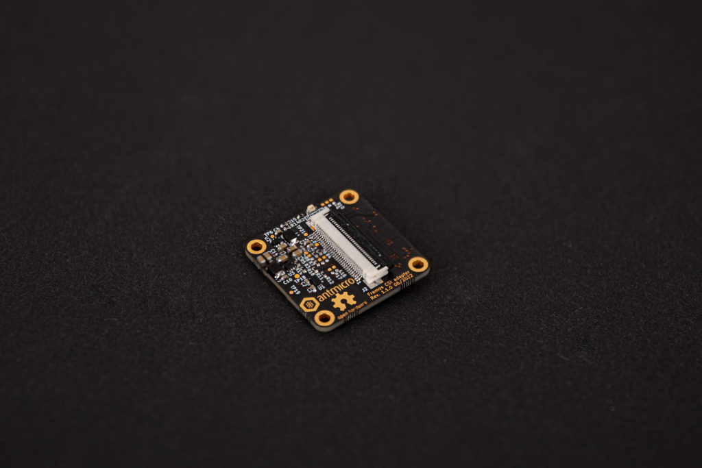

# Framos CSI Adapter

Copyright (c) 2022 [Antmicro](https://www.antmicro.com>)

## Overview

This repository contains open hardware design files for an FSA to CSI Adapter.

The board serves as a connector adapter between a [FRAMOS Sensor Module Adapter](https://www.framos.com/en/products/framos-sensor-module-adapter-fsa-22408) (FSA) and a 30-wire I-PEX micro coax cable.

The adapter board is the same size as the FSA and can be stacked with it.
The adapter board can be interfaced with a variety of video processing platforms created by Antmicro using the [Dual I-PEX CSI Interposer](https://github.com/antmicro/dual-ipex-csi-interposer).

## Repository structure

The main repository directory contains KiCad PCB project files, a [LICENSE](LICENSE), and a README.

The remaining files are stored in the following directories:

* `lib` - contains the component libraries
* `doc` - contains the adapter [schematics](doc/framos-csi-adapter.pdf)
* `img` - contains graphics for this README
* `assets` - contains visual assets for showcasing this design on [Open Hardware Portal](https://openhardware.antmicro.com)

## Key features

* MIPI CSI-2 camera interface
* On-board DC-DC converters to power the FSA board and camera module
* I2C bus voltage level translator
* DF40C-60DS connector for [FRAMOS Sensor Module Adapter](https://www.framos.com/en/products/framos-sensor-module-adapter-fsa-22408)
* MSAK24024 Series 30-pin IPEX-type connector

## License

[Apache-2.0](LICENSE)
