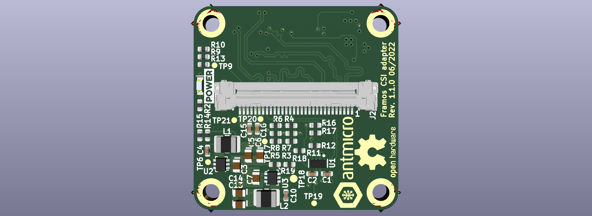

# Framos CSI Adapter
Copyright (c) 2018-2022 [Antmicro](https://www.antmicro.com>)

## Overview
This repository contains open hardware design files for an CSI Adapter.
Board serves as an adapter between a `Framos Sensor Adapter` (FSA) and a 30-pin wire to board connector. Adapter board has the same size as FSA and stacks with it when connected. 
The design files were prepared in KiCad 6.

## Repository structure
The main repository directory contains KiCad PCB project files, a LICENSE and README.
The remaining files are stored in the following directories:

* `lib` - contains the component libraries
* `img` - contains graphics for this README

## Key features
* On-board DC-DC converters to power the FSA board
* Voltage level translator for I2C interface
* DF40C-60DS connector compatibile with `Framos Sensor Adapter`
* MSAK24024 Series 30-pin connector compatibile [Dual Ipex CSI Interposer](github_address) developed by Antmicro 

## License

[Apache-2.0](LICENSE)
